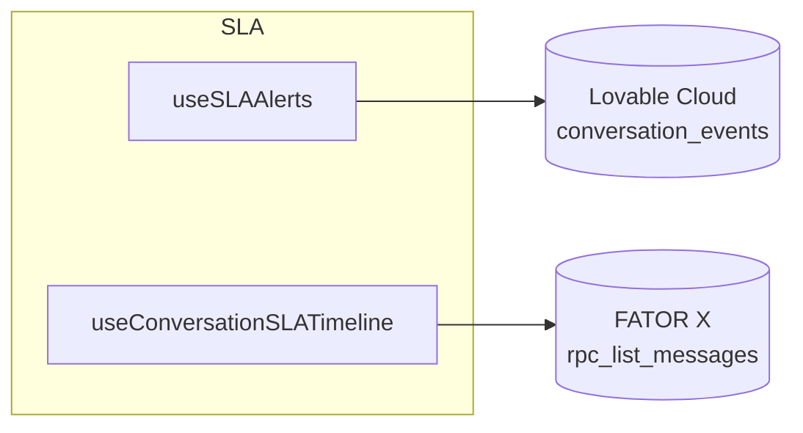

## Diagrama Mermaid navegável — hooks & módulos (20–23 abr)

### O que vai ser entregue

Um diagrama Mermaid `graph LR` em `/mnt/documents/MAPA_HOOKS_DEPENDENCIAS_NAVEGAVEL.mmd` onde **cada nó é clicável** e abre o arquivo correspondente no repositório, usando a sintaxe `click NodeId "URL"`.

### Estrutura do diagrama

Subgrafos por domínio (mesma taxonomia do mapa anterior):

1. **SLA & Timeline** — `useConversationSLATimeline`, `useSLAAlerts`, `SLATimelineSection`
2. **DLQ & Retry** — `useFailedMessages`, `useFailedMessageAlerts`, `useInstanceRetryConfig`, `evolutionSendRetry`, `lib/retry`, `lib/retryAlerts`
3. **Realtime & Presença** — `useIncomingCallBroadcast`, `useContactTyping`, `useTypingPresence`, `useMessageUpdateBatcher`, `useMessageSendStatus`
4. **Webhook Health** — `useWebhookHealthAlerts`, `lib/webhookHealthAlerts`
5. **Backends** (nós-âncora estilizados) — `Lovable Cloud`, `FATOR X`, `Edge Functions`

### Sintaxe usada (exemplo)

Cada `click` aponta para o caminho relativo do arquivo no repo (formato `src/...`), funcional no preview do Mermaid Live Editor e em qualquer viewer compatível.

### Como vou construir

1. **Verificar existência** dos arquivos com `code--list_dir` em `src/hooks/`, `src/hooks/realtime/`, `src/hooks/messaging/`, `src/lib/` para evitar links quebrados.
2. **Mapear chamadas reais** com `code--search_files` (ex: `useFailedMessages\(`, `evolutionSendRetry\(`) para desenhar arestas verídicas (até 3 consumidores por hook, sem inventar).
3. **Escrever** `/mnt/documents/MAPA_HOOKS_DEPENDENCIAS_NAVEGAVEL.mmd` com:
   - Subgrafos por domínio
   - Arestas direcionadas (`-->` para chamadas síncronas, `-.->` para realtime/broadcast)
   - Nós de backend em formato `[(...)]` (cilindro) para destacar persistência
   - Bloco `click` para cada hook/util com path relativo
4. **Emitir** `<lov-artifact mime_type="text/vnd.mermaid">` apontando para o arquivo.
5. **QA**: validar sintaxe rodando o `.mmd` por um parser local (`@mermaid-js/mermaid-cli` via `nix run` se necessário) e checar que todos os `click` referenciam arquivos existentes.

### Detalhes técnicos

- **Sem cores customizadas** — auto-tema light/dark do Mermaid (regra do projeto).
- **Sem emojis** nos labels (causam lexer error).
- **Legendas textuais** para tipos de aresta no rodapé do `.mmd` via comentários `%%`.
- **Limite ~25 nós** para legibilidade; hooks fora do escopo 20–23 ficam de fora.
- Nó "ghost" `useTypingPresence` marcado com label `[useTypingPresence — BUG: oderId]` para destacar dívida técnica documentada.

### Arquivos afetados

**Criar:**
- `/mnt/documents/MAPA_HOOKS_DEPENDENCIAS_NAVEGAVEL.mmd`

**Não edita código-fonte.**

### Fora de escopo

- Renderização do diagrama em PNG/SVG estático — Lovable já renderiza `.mmd` inline via `<lov-artifact>`.
- Inclusão de hooks anteriores a 20/abr (já cobertos por relatórios anteriores).
- Correção do bug `oderId` — apenas anotação visual no diagrama.

