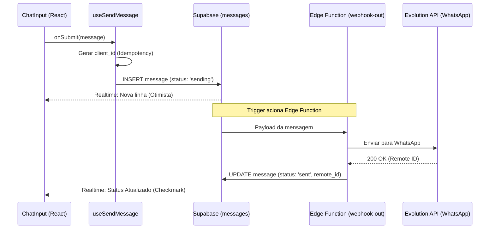

# Guia de Arquitetura e Fluxo de Dados - Zapp Web

Este documento detalha a arquitetura técnica, o fluxo de dados e os padrões de desenvolvimento utilizados no projeto Zapp Web, servindo como referência para a manutenção e evolução da plataforma.

## 1. Visão Geral da Arquitetura

A plataforma é construída sobre uma arquitetura moderna e escalável, utilizando o ecossistema Supabase para o backend e React para o frontend.

- **Frontend:** React + TypeScript + Vite + Tailwind CSS + Shadcn UI.
- **Backend (BaaS):** Supabase (PostgreSQL, Auth, Realtime, Edge Functions, Storage).
- **Integrações Externas:** Evolution API (WhatsApp), External DB Bridge.

### Camadas de Responsabilidade

1.  **Apresentação (UI):** Componentes React puros e hooks de interface.
2.  **Hooks de Negócio:** Camada de abstração que gerencia estados complexos (ex: `useInbox`, `useMessages`).
3.  **Serviços de Dados (API):** Clientes Supabase e integração com Edge Functions.
4.  **Banco de Dados & Realtime:** PostgreSQL com RLS (Row Level Security) e CDC (Change Data Capture) para atualizações instantâneas.

---

## 2. Diagrama de Sequência: Fluxo de Mensagem

O diagrama abaixo ilustra o ciclo de vida completo de uma mensagem enviada pelo atendente, desde a interação na UI até a confirmação via Realtime.



---

## 3. Mapa do Projeto (Estrutura de Pastas)

```text
/src
  /components     # Componentes de UI (Shadcn) e Organismos (Chat, Inbox)
  /hooks          # Lógica de negócio e hooks de Realtime
    - useRealtimeMessages.ts  # Sincronização de chat
    - useInbox.ts             # Gestão da lista de conversas
  /services       # Chamadas diretas ao Supabase e APIs externas
  /types          # Definições de TypeScript compartilhadas
  /lib            # Utilitários (utils.ts, supabase.ts)
/supabase
  /functions      # Edge Functions (Deno/TypeScript)
    - external-db-bridge      # Ponte para bancos externos
    - auth-email-hook         # Customização de e-mails
  /migrations     # Histórico de alterações no banco de dados
```

---

## 4. Contratos da Edge Function: `external-db-bridge`

Esta função atua como um gateway seguro para operações de leitura e escrita em bancos de dados externos ou tabelas protegidas.

### Endpoint: `/external-db-bridge`
**Método:** `POST`

#### Request Body
```json
{
  "action": "query|insert|update",
  "table": "string",
  "payload": "object",
  "idempotencyKey": "uuid (opcional)"
}
```

#### Erros Padronizados
- `401 Unauthorized`: Token JWT inválido ou expirado.
- `403 Forbidden`: RLS impediu a operação para o usuário atual.
- `422 Unprocessable Entity`: Payload fora do schema esperado.
- `429 Too Many Requests`: Rate limit atingido.

---

## 5. Diretrizes para Desenvolvedores

1.  **Idempotência**: Sempre envie um `client_id` ou `Idempotency-Key` em operações de escrita para evitar duplicidade em casos de retry de rede.
2.  **Segurança**: Nunca ignore o RLS. Se precisar de permissões elevadas, use o `service_role` exclusivamente dentro de Edge Functions monitoradas.
3.  **Realtime**: Prefira assinaturas Realtime (`supabase.channel`) em vez de polling.
4.  **Performance**: Utilize o hook `useQuery` do TanStack Query para cache e invalidação de estados do lado do servidor.

---

Este guia deve ser atualizado sempre que houver mudanças estruturais na arquitetura do sistema.
