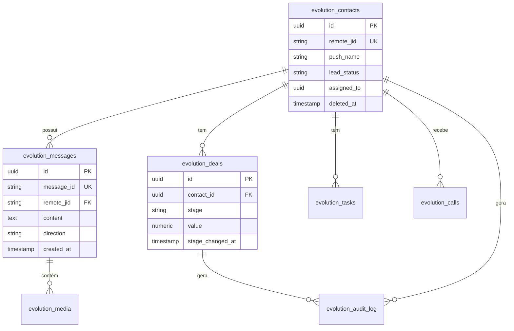

# 📊 Diagrama ER — FATOR X (CRM & WhatsApp)

## 🔐 Segurança (RLS)
- Todas as tabelas `evolution_*` possuem RLS ativo.
- Acesso de escrita é restrito a RPCs `SECURITY DEFINER`.
- Acesso de leitura é filtrado por `assigned_to` ou `department_id`.
