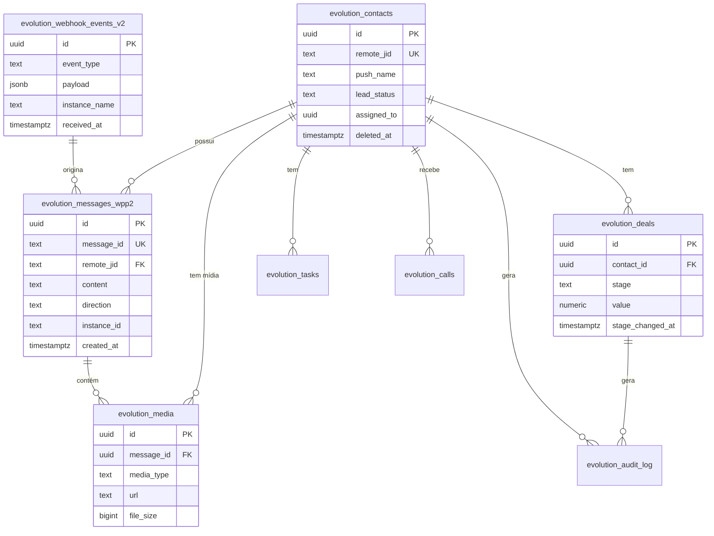
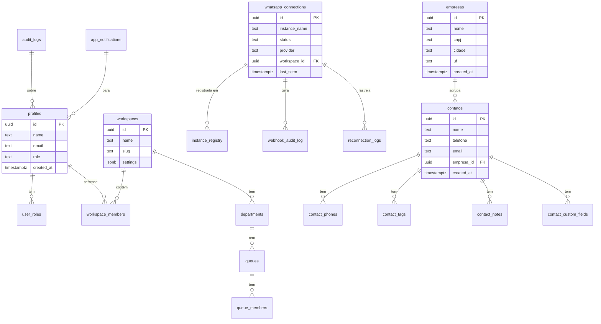

# 📊 Diagrama ER — ZAPP WEB (Supabase Self-Hosted)

> **Schemas reais (medidos ao vivo em 2026-09-05, `pg_class`)**: `zapp` **387** tabelas base · `evo` **76**.
> As contagens antigas deste arquivo (315/193, auditoria de 2026-07-15) estavam desatualizadas —
> o catálogo completo e atual (tabelas, colunas, comments) é gerado em
> [`DICIONARIO-BANCO.md`](./DICIONARIO-BANCO.md); este diagrama cobre só as entidades centrais.

## Schema `evo` — Evolution API (fonte de mensagens)

```mermaid
erDiagram
    evolution_contacts ||--o{ evolution_messages_wpp2 : "possui"
    evolution_contacts ||--o{ evolution_deals : "tem"
    evolution_contacts ||--o{ evolution_tasks : "tem"
    evolution_contacts ||--o{ evolution_calls : "recebe"
    evolution_contacts ||--o{ evolution_media : "tem mídia"

    evolution_deals ||--o{ evolution_audit_log : "gera"
    evolution_contacts ||--o{ evolution_audit_log : "gera"

    evolution_messages_wpp2 ||--o{ evolution_media : "contém"
    evolution_webhook_events_v2 ||--o{ evolution_messages_wpp2 : "origina"

    evolution_contacts {
        uuid id PK
        text remote_jid UK
        text push_name
        text lead_status
        uuid assigned_to
        timestamptz deleted_at
    }

    evolution_messages_wpp2 {
        uuid id PK
        text message_id UK
        text remote_jid FK
        text content
        text direction
        text instance_id
        timestamptz created_at
    }

    evolution_webhook_events_v2 {
        uuid id PK
        text event_type
        jsonb payload
        text instance_name
        timestamptz received_at
    }

    evolution_deals {
        uuid id PK
        uuid contact_id FK
        text stage
        numeric value
        timestamptz stage_changed_at
    }

    evolution_media {
        uuid id PK
        uuid message_id FK
        text media_type
        text url
        bigint file_size
    }
```

> **Nota sobre particionamento**: `evolution_messages` e `evolution_conversations` são tabelas-pai particionadas.
> Os dados reais ficam nas partições por instância: `evolution_messages_wpp2`, `evolution_messages_comercial_01`, etc.
> O mesmo vale para `evolution_webhook_events_v2` (particionado por mês).

## Schema `zapp` — Aplicação ZAPP Web

```mermaid
erDiagram
    profiles ||--o{ user_roles : "tem"
    profiles ||--o{ workspace_members : "pertence"
    workspaces ||--o{ workspace_members : "contém"
    workspaces ||--o{ departments : "tem"
    departments ||--o{ queues : "tem"
    queues ||--o{ queue_members : "tem"

    whatsapp_connections ||--o{ instance_registry : "registrada em"
    whatsapp_connections ||--o{ webhook_audit_log : "gera"
    whatsapp_connections ||--o{ reconnection_logs : "rastreia"

    contatos ||--o{ contact_phones : "tem"
    contatos ||--o{ contact_tags : "tem"
    contatos ||--o{ contact_notes : "tem"
    contatos ||--o{ contact_custom_fields : "tem"

    empresas ||--o{ contatos : "agrupa"

    audit_logs ||--o{ profiles : "sobre"
    app_notifications ||--o{ profiles : "para"

    profiles {
        uuid id PK
        text name
        text email
        text role
        timestamptz created_at
    }

    workspaces {
        uuid id PK
        text name
        text slug
        jsonb settings
    }

    whatsapp_connections {
        uuid id PK
        text instance_name
        text status
        text provider
        uuid workspace_id FK
        timestamptz last_seen
    }

    contatos {
        uuid id PK
        text nome
        text telefone
        text email
        uuid empresa_id FK
        timestamptz created_at
    }

    empresas {
        uuid id PK
        text nome
        text cnpj
        text cidade
        text uf
        timestamptz created_at
    }
```

## 🔐 Segurança (RLS)

- **100% das tabelas** nos schemas `zapp` e `evo` possuem RLS ativo.
- Acesso de escrita é restrito a RPCs com `SECURITY DEFINER`.
- Acesso de leitura é filtrado por `workspace_id`, `assigned_to` ou `department_id`.
- Schema `public` tem **zero tabelas** — só views/proxies.

## Mapeamento de Schemas

| Schema | Acesso no código | Exemplo de query |
|--------|-----------------|-----------------|
| `zapp` | `supabase.from('profiles')` (default) | `createClient({ db: { schema: 'zapp' } })` |
| `evo` | `supabase.schema('evo').from('evolution_contacts')` | Realtime subscriptions de mensagens |
| `auth` | `supabase.auth.*` | `supabase.auth.getUser()` |
| `public` | Não usar diretamente | Views materializadas apenas |
