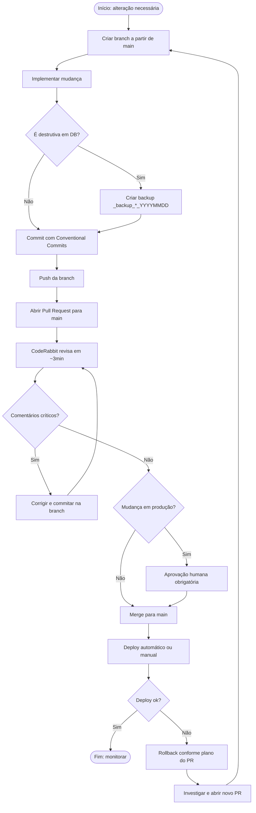

# Fluxo de Deploy — Promo Brindes

> Padrão BPM unificado. Todo deploy passa por este fluxo.

## 🎯 Objetivo

Garantir que toda mudança em produção seja:

1. **Rastreável** — PR no histórico
2. **Revisada** — CodeRabbit + opcional humano
3. **Reversível** — plano de rollback documentado
4. **Segura** — sem secrets vazados, sem operações destrutivas sem backup

## 🔄 Diagrama BPMN

## 👥 Atores

| Papel | Responsabilidade |
|---|---|
| **Desenvolvedor** (Claude/Pink) | Criar branch, implementar, abrir PR |
| **CodeRabbit** | Revisão automática (bugs, security, performance) |
| **Aprovador humano** (Pink) | Validar mudança em produção, aceitar trade-offs |
| **CI** | Linters, secret scan, type check |

## 🚪 Gates (regras de negócio)

1. **Branch protegida** — `main` não aceita push direto
2. **Review obrigatória** — CodeRabbit deve revisar antes do merge
3. **Comentários críticos** — issues marcadas `🛑 critical` ou `🔒 security` bloqueiam merge até resolução
4. **Backup obrigatório** — qualquer DROP/TRUNCATE/ALTER incompatível precisa de backup prévio
5. **Secrets** — gitleaks no CodeRabbit + workflow CI; PR com secret detectado é automaticamente bloqueado

## 📊 KPIs do processo

| Indicador | Meta | Como medir |
|---|---|---|
| **Lead time PR → merge** | ≤ 1 dia | GitHub Insights |
| **% PRs revisados pelo CodeRabbit** | 100% | Auditoria mensal |
| **% comentários críticos resolvidos antes do merge** | 100% | Auditoria mensal |
| **% deploys com rollback** | < 5% | Histórico de revert commits |
| **Secrets vazados em commits** | 0 | Gitleaks + auditoria GitHub |

## 🚨 Gatilhos de exceção

### Hotfix urgente em produção

1. Branch `hotfix/<descricao>` a partir de `main`
2. PR com label `hotfix` — CodeRabbit ainda revisa, mas merge pode ser feito sem aprovação humana adicional se Pink for o autor
3. Atualizar `CHANGELOG.md` no mesmo PR
4. Pós-mortem em até 48h se causou downtime

### Rollback

1. `git revert <sha do merge>` em nova branch
2. PR `revert/<descricao>` com label `urgent`
3. Merge imediato após CodeRabbit confirmar que reverte limpo

## 🔗 Ferramentas

- **GitHub** — repositório, PRs, branch protection
- **CodeRabbit** — revisão IA automática (configurada em `.coderabbit.yaml`)
- **Dependabot** — atualizações de dependência semanais
- **Gitleaks** — scan de secrets em CI e via CodeRabbit
- **Supabase** — DB e Edge Functions
- **n8n** — automação de workflows
